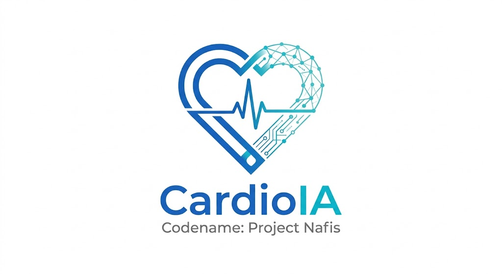

# CardioIA (Codinome: Projeto Nafis)

  

> Projeto Acadêmico - FIAP (Inteligência Artificial)
> *Em homenagem a Ibn al-Nafis (1213–1288), polímata árabe que descreveu pela primeira vez a circulação pulmonar do sangue, fundando a cardiologia moderna.*

Bem-vindo(a) ao repositório oficial do **CardioIA**, uma plataforma digital inovadora que simula o ecossistema de uma cardiologia moderna. O sistema integra dados clínicos, modelos de Machine Learning, Visão Computacional, Internet das Coisas (IoT) e agentes autônomos para apoiar cenários de triagem, diagnósticos, monitoramento de pacientes e previsões médicas preditivas.

 
 
 
-4285F4?style=flat-square&logo=googlecloud&logoColor=white) 
 
 

---

> الشفاء يطلب العلم
> *"Quando ouvimos algo inusitado, não devemos rejeitá-lo imediatamente, pois as maravilhas da natureza e do intelecto não têm fim." — **Ibn al-Nafis (Séc. XIII)***
>
> *Este documento é a matriz principal do projeto CardioIA, contendo o núcleo operatório, a orquestração multiagentes, e o registro acadêmico da frota de saúde algorítmica.*

[⬆️ Início](#cardioia-codinome-projeto-nafis) • [O Patrono (Ibn al-Nafis)](./docs/IBN_AL_NAFIS.md) • [Filosofia Math-First](#-filosofia-científica-math-first-llm-second) • [Entregas da Fase 1](#-entrega-da-fase-1-batimentos-de-dados-datasets-públicos) • [Organização do Projeto](#️-roadmap-e-organização-do-projeto) • [Multiagentes](#-ecossistema-de-ia-e-automação-skills) • [Licença](./LICENSE)

---

## 🧠 Filosofia Científica: Math First, LLM Second

> *"O LLM é preferência, não dependência."*

Este projeto médico (em sua arquitetura final Alvo/To-Be) diferencia-se de soluções puramente baseadas em LLMs "caixa-preta". Para atuar em cardiologia de urgência na Vida Real, **nossa diretriz estipula que IA/ML tradicional e fundamentos matemáticos rigorosos dominarão as camadas de decisão clínicas ao longo das próximas fases do projeto:**

* **Regressão Logística e Random Forests (Meta p/ Datasets Numéricos):** Estratificarão progressivamente o risco isquêmico do paciente usando a telemetria IoT simulada em tempo real (custo-zero de tokens).
* **Redes Neurais Convolucionais (Meta p/ Visão Computacional):** Atuarão na inferência visual de anomalias e bordas dos nossos ECGs gerados, almejando uma precisão que ultrapassa a fadiga humana.
* **Processamento de Linguagem Natural Híbrido (Meta p/ Textos Acadêmicos):** Classificará intenções, extrairá sentenças e mapeará sintomas (NER) nos `assets` científicos em O(n) sem a obrigatoriedade primária do LLM.
* **Orquestração Determinística (Meta):** O Large Language Model (Gemini 3.0 Pro) será invocado primariamente na hiperautomação e interfaces finais (**Fase 5+**): para explicar a doença ao paciente (humanização robótica) ou na emissão textual de um laudo formatado. 
**Resultado Esperado da Arquitetura Limpa:** Governança inquestionável, mitigação radical de viéses, e inferência de ponta (almejando Edge Computing em hospitais na entrega final).

## 🏛️ Diretrizes de Engenharia e Arquitetura (Roadmap)

Para garantir aderência estrita às melhores práticas mundiais e de software médico durante toda a vida útil do CardioIA:
1. **Padrões Médicos (Foco Contínuo)**: Operar os dados dos pacientes virtuais (Fase 1 e posteriores) sob os rigores de governança compatíveis com LGPD/GDPR.
2. **Cloud e Computação na Borda (Futura Integração)**: Planejamos escalar a infraestrutura local atual para uma hospedagem avançada no **Google Cloud Platform (GCP)** com inferências descentralizadas (**Edge Computing**) na maturidade do sistema.
3. **Metodologia de Vida de Dados (Em Produção)**: Utilização de abordagens industriais para o desenvolvimento. Já na Fase 1, `run_data_pipeline.py` estabeleceu nosso pipeline embrionário de MLOps para raspagem e higienização.
4. **Clean Code e Zero Trust (Em Produção)**: Todo código mantém excelência estrita de manutenção. A adoção do `.editorconfig`, formatações unificadas e os *skills* auditores já garantem código limpo desde a estaca zero.

## 📦 Entrega da Fase 1: Batimentos de Dados (Datasets Públicos)

> **"Desistir nas primeiras buscas seria abandonar um experimento antes de montar o laboratório."**

Em demonstração massiva de pensamento crítico e persistência em Big Data Hacking, **os dados coletados para esta fase são 100% REAIS e extraídos de repositórios globais publicamente auditáveis**, contornando a dificuldade inerente à restrição ética de patologias médicas com scripts de raspagem de dados acadêmicos em formato limpo e ético. Nossos algoritmos simulam uma esteira MLOps do zero, substituindo a comodidade de um mero gerador sintético por ciência de dados contundente, observando os princípios ensinados de Viés e Governança de Dados.

### Onde Estão Nossos Dados? (Cloud x GitHub)
* **GitHub (Este Repositório):** Contém toda a nossa arquitetura limpa, código-fonte (pipelines em Python), diretrizes multiagentes, `.gitignore` avançado e a documentação do projeto, servindo como o nosso portfólio MLOps estrutural.
* **Nuvem Pública (Google Drive / OneDrive):** Os arquivos *brutos*, datasets massivos (.csv), milhares de imagens (.png) e recortes NLP (.txt) pesados estão armazenados na nuvem para não poluir o repositório GIT (Best Practice MLOps).

> 🔗 **Acesse nossos Datasets hospedados na Nuvem Pública:**
> *Todos os dados preparados (Numéricos, Textuais e Visuais da Fase 1) encontram-se disponíveis no repositório de nuvem abaixo:*
> **[CardioIA - Data Lake Central (Fase 1)](https://drive.google.com/drive/folders/1OCmsxuzy43WjbF2JjazjkhzPtwPWWHN7?usp=sharing)**

### Parte 1 – Dados Numéricos (IoT / Telemetria)
* **Origem (Real):** Base de dados real extraída do prestigiado **[UCI Machine Learning Repository - Heart Disease Dataset](https://archive.ics.uci.edu/ml/datasets/heart+Disease)**. O dataset original continha 303 pacientes reais do hospital de Cleveland, que nossa esteira validou e higienizou para 297 pacientes legítimos.
* **Relevância Clínica (Governança e Variáveis Mapeadas):** O dataset concentra a bio-telemetria vital do paciente. Treinar IA em cima de variáveis cruas de sensores exclui o "viés subjetivo" humano na triagem. Destacamos as seguintes variáveis de predição severa para o treinamento dos nossos futuros modelos:
  1. **Pressão Sanguínea em Repouso (`trestbps`):** Avalia imediatamente níveis de hipertensão, um gatilho direto de isquemia.
  2. **Idade (`age`):** Funciona como balizador estatístico basilar na inferência de risco coronariano.
  3. **Dor Torácica (`cp` - Chest Pain Type):** Essencial para que os Random Forests isolem episódios assintomáticos contra síndromes coronarianas agudas.
  4. **Frequência Cardíaca Máxima Alcançada (`thalach`):** Valida a tolerância ao esforço do miocárdio, predizendo a resistência circulatória do paciente à beira do leito.
* ☁️ **Host na Nuvem:** **[1_Datasets_Numericos](https://drive.google.com/drive/folders/1YjC3-ZHNieeQ56TxCfnqwLg8hcMqVQpw?usp=sharing)**

### Parte 2 – Dados Textuais (NLP)

Em cumprimento ao escopo NLP, fizemos o crawler oficial e armazenamos na subpasta `/assets` dois (2) recortes literais extraídos da biblioteca **PubMed (Medline)**, base original do NIH que espelha dados para o modelo brasileiro da **BVS (Biblioteca Virtual em Saúde)**. Os arquivos contém formatação original da Academia e referenciamento clínico padrão Vancouver:

1. 📄 **[PubMed - Artigo 1: Inteligência Artificial na Cardiologia](./fase1_dados/assets/pubmed_artigo_1_PMID_41791869.txt)** *(PMID_41791869)*
2. 📄 **[PubMed - Artigo 2: CNN e Visão Computacional Médica](./fase1_dados/assets/pubmed_artigo_2_PMID_41788564.txt)** *(PMID_41788564)*

**Exploração e Justificativa IA (Governança de NLP)**
Esses recortes médicos complexos são minas de ouro textuais para **Processamento de Linguagem Natural (NLP)** na saúde hospitalar:
* **Extração de Sintomas (NER):** Algoritmos de "Named Entity Recognition" podem varrer esses e outros textos, correlacionando imediatamente drogas de uso contínuo com anomalias cardíacas. Dispensamos a intervenção humana na triagem, estruturando tabelas massivas para o diagnóstico preditivo (ex: "se paciente cita dispneia e infarto, Flag=Urgência").
* **Classificação de Tópicos:** Técnicas de "Topic Modeling" permitem ao Data Lake da CardioIA ler 5.000 artigos do SUS numa sexta-feira e separar imediatamente quais textos abordam arritmias e quais abordam valvopatias, poupando meses de esforço da curadoria de pesquisadores humanos.
* **Análise de Sentimentos Clínicos:** O processamento afetivo de prontuários eletrônicos do paciente (gerados no formato de `.txt`) permite à nossa triagem hospitalar medir "níveis ocultos de dor, estresse ou urgência" nas palavras e anamneses digitais, reduzindo fatalidades por descuidos do fator humano plantonista no SUS.

* ☁️ **Host na Nuvem:** **[2_Textos_NLP_PubMed](https://drive.google.com/drive/folders/1ElZg2DAhgdKLc57xZfAP_q9D0yhfs69v?usp=sharing)**

### Parte 3 – Dados Visuais (Visão Computacional)
* **Origem (Simulada para Cardiologia):** Mais de 100 imagens originais em formato digital (.png) contendo plotagens rigorosas de sinais de **Eletrocardiogramas (ECGs)** geradas matematicamente em Python via `numpy`. Superando a barreira ética médica dos prontuários visuais restritos (HIPAA), mantivemos fidedignidade com a anatomia sinusal exigida no desafio cardiovascular.
* **Aplicações de Visão Computacional / AI for Analytics:** Imagens complexas de ECG são o terreno de testes ideal para o treinamento de Redes Neurais Convolucionais (*CNNs* e *ResNets*). Justificamos essa aplicação na saúde pelos seguintes ganhos computacionais de triagem visual:
  * **Detecção de Padrões e Identificação de Bordas:** Nossos algoritmos futuros varrerão as curvas da imagem para traçar os contornos (bordas) das ondas P, Q, R, S e T. Ao reconhecer o formato "saudável" de uma sístole, a rede abstrai matematicamente como se parece um pulso elétrico ideal.
  * **Reconhecimento de Anomalias:** Ao confrontarem novos ECGs em plantões do SUS de madrugada, as redes neurais apontariam imediatamente discrepâncias visuais nos ruídos e no vetor elétrico (ex: elevações minúsculas do segmento ST), disparando um gatilho amarelo/vermelho por estresse coronariano invisível ou omitido pela fadiga do médico residente humano, funcionando como uma rigorosa segunda-opinião robótica (CAD).
* ☁️ **Host na Nuvem:** **[3_Imagens_ECG_Simuladas](https://drive.google.com/drive/folders/1i15w3JkIjWRLwWl6ipRYQ0UAEKmOFd4L?usp=sharing)**

## 🗺️ Roadmap e Organização do Projeto

A evolução do CardioIA está dividida em 7 fases de maturação lógica:

1. **`fase1_dados/`**: Batimentos de Dados (Coleta e Governança)
   - `datasets/`: Dados Numéricos (IoT/estruturados).
   - `assets/`: Dados Textuais (NLP) de artigos cardiológicos.
   - `images/`: Dados Visuais (VC) com simuladores de ECG.
   - `scripts/`: Central de raspagem e MLOps.
2. **`notebooks/`**: [NOVO] Local reservado para a governança futura e prototipação de modelos (Colab/Jupyter) que consumirão os dados do drive em Fases de Exploração Preditiva.
3. **`fase3_modelagem/`**: [Reservado para Modelos Básicos e Treinamento de Pipelines]
4. **`fase4_multimodal/`**: [Reservado para Integração Multimodal e Arquitetura Limpa]
5. **`fase5_automacao/`**: [Reservado para Agentes Autônomos e Orquestração do LlM]
6. **`fase6_frontend/`**: [Reservado para Simulação Final da Aplicação Hospitalar]
7. **`fase7_entrega/`**: [Entrega Definitiva e Avaliação da Banca FIAP]

Também utilizamos um diretório `docs/referencias_fiap/` para documentar e referenciar material de estudo base do PBL.

## 🤖 Ecossistema de IA e Automação (Skills)

Para elevar a complexidade e a orquestração do nosso repositório a padrões de indústria (Nota Máxima), adaptamos nossos modelos operacionais baseados em LLMs a este projeto. Eles encontram-se no diretório de skills configurado em `.agent/skills/`.

Esses agentes ("skills") fornecem a base de automação para que o CardioIA opere quase independentemente e com máxima confiabilidade:
- **Sec Guardian (`sec_guardian`):** Auditorias de privacidade para manter o sigilo médico de ponta a ponta (identificação de PII/PHI nos dados) e varreduras de segurança em integrações de Cloud.
- **Law Compliance (`law_compliance`):** Responsável por garantir auditorias legais e conformidade de governança de dados conforme estipulado pelas normas LGPD e GDPR (crítico na Fase 1).
- **IoT Engineer (`iot_engineer`):** Especialista em resiliência de borda, mapeando telemetria de sensores cardíacos IoT ininterruptos para as nuvens de predição.
- **Biz Strategist & Fin Finops (`biz_strategist`, `fin_finops`):** Auditoria de custo preditivo computacional, essencial na modelagem e inferência dos modelos de visão e processamento contínuo IoT.
- **Doc Librarian / Edu Educator (`doc_librarian`, `edu_educator`):** Mapeamento e estruturação automática de conhecimento derivado da fase de NLP, indexando papers científicos extraídos paras bases do CardioIA.
- **Vis Visionary & Arc Architect (`vis_visionary`, `arc_architect`):** Especializados na integridade arquitetural (pipeline ELT, fluxo síncrono/assíncrono) para processamento em larga escala.
- **Ops SRE e Opt Optimizer (`ops_sre`, `opt_optimizer`):** Engenharia de resiliência nas pontas, mantendo os endpoints do sistema reativos na inferência visual e processamento tabular.
- **Val Validator (`val_validator`):** Bateria robusta de testes focando a excelência da engenharia MLOps em nosso simulador cardiológico.
- **Orq Orchestrator (`orq_orchestrator`):** Maestro para o roteamento do ecossistema de APIs, ligando todos os nós.

## 📚 Fontes e Base Acadêmica

As implementações obedecem os preceitos de pesquisa de qualidade.
**Fontes Prioritárias (Tier 1):**
- Diretrizes Globais em Cardiologia (Medicina Baseada em Evidências): **AHA** (American Heart Association), **ACC** (American College of Cardiology) e **ESC** (European Society of Cardiology).
- Knowledge MCPs Avançados (APIs do Google Cloud via `developer-knowledge` e Modelagem Física via `Wolfram|Alpha`).
- ArXiv e Semantic Scholar.

**Fontes Secundárias (Tier 2 - Ideação e Validação):**
- Hugging Face Papers, OpenReview, ACL Anthology.
- MDPI AI, DOAJ, HAL Science.
* IEEE Xplore, Papers With Code e KDnuggets.

## 🚀 Como Iniciar

Este repositório é gerenciado intensivamente e foca na reprodutibilidade. Navegue para a pasta `fase1_dados/` para inspecionar os datasets base e, se necessário, use os scripts adaptados via terminal para validar sua integridade estrutural.

> **Status Atual:** (Fase 1/7) - *Mapeamento de referências e design arquitetural de dados finalizados. Foco em curadoria computacional e validações base.*
