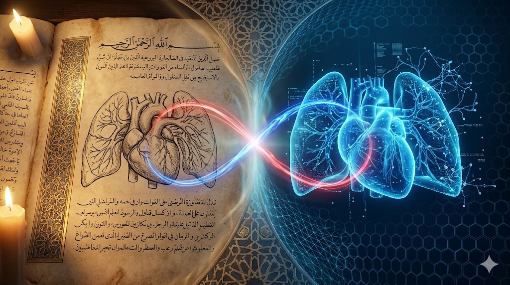

# 🌙 O Patrono: Ala-al-Din Abu al-Hasan Ali ibn Abi-Hazm al-Qarshi al-Dimashqi (Ibn al-Nafis)

> **"Quando ouvimos algo inusitado, não devemos rejeitá-lo imediatamente, pois as maravilhas da natureza e do intelecto não têm fim."** — *Ibn al-Nafis*

[⬆️ Início](#cardioia-codinome-projeto-nafis) • [O Patrono (Ibn al-Nafis)](./docs/IBN_AL_NAFIS.md) • [Filosofia Math-First](#-filosofia-científica-math-first-llm-second) • [Entregas da Fase 1](#-entrega-da-fase-1-batimentos-de-dados-datasets-públicos) • [Organização do Projeto](#️-roadmap-e-organização-do-projeto) • [Multiagentes](#-ecossistema-de-ia-e-automação-skills) • [Licença](./LICENSE)

  
  <h2 align="center">ابن النفيس</h2>

## O Desbravador do Fluxo Vital

Muito antes de William Harvey (1628) detalhar a circulação sanguínea na Europa, o polímata árabe **Ibn al-Nafis (1213–1288)**, nascido em Damasco, operava como Chefe dos Médicos (*Rais al-Atibba*) no reverenciado Hospital Al-Mansuri, no Cairo. 

Desafiando a autoridade médica suprema da época (clássicos de Galeno e Avicena), Ibn al-Nafis fundamentou-se em observação rigorosa e dedução analítica para descrever metodicamente a **Circulação Pulmonar (Menor)** do sangue humano. Ele refutou a crença milenar de que o sangue passava diretamente do ventrículo direito para o ventrículo esquerdo através de póros invisíveis no septo cardíaco. Em sua obra seminal *Sharh Tashrih al-Qanun Ibn Sina* (Comentário sobre a Anatomia do Cânone de Avicena), ele postulou que o sangue deve viajar do ventrículo direito para os pulmões, onde se mistura com o ar, antes de retornar ao coração esquerdo.

Essa audácia empírica, ancorada no ceticismo científico e na reverência anatômica, marca o verdadeiro nascimento da **Cardiologia Moderna**.

## 🩸 O Simbolismo no Projeto CardioIA

A escolha de Ibn al-Nafis como patrono e codinome deste projeto (Projeto Nafis) não é fortuita. Ela encapsula os valores fundamentais do nosso ecossistema de Inteligência Artificial:

1. **Rigor sobre o Dogma:** Assim como Nafis rejeitou a "caixa-preta" das teorias galênicas através da investigação dedutiva, a arquitetura **Math First** do CardioIA não confia cegamente em Grandes Modelos de Linguagem (LLMs). Nós exigimos explicabilidade, cálculos precisos e modelos matemáticos auditáveis nas pontas de decisão.
2. **A Rede Pulmonar como Algoritmo:** A genialidade de Nafis esteve em mapear o "*fluxo de dados*" do coração aos pulmões e de volta ao coração. Da mesma forma, nosso ecossistema funciona: sensores IoT enviam o sangue (telemetria visual e numérica), Redes Neurais e Regressões filtram as informações (pulmões), e os Multiagentes bombeiam o diagnóstico limpo e sem viés para a aplicação de saúde.
3. **Respeito Profundo à Vida:** Como médico e jurista, Nafis sustentava a ética acima das experimentações levianas. Nossas rigorosas governanças de privacidade (Zero Trust e conformidade LGPD/HIPAA representadas por `@sec_guardian` e `@law_compliance`) ecoam diretamente sua retidão profissional.

## 🕌 O Legado: Encontro entre Oriente Clássico e o Silício Contemporâneo

Na Era de Ouro Islâmica (*Bait al-Hikmah* e grandes maristanes hospitalares), a ciência era multidisciplinar — filosofia, anatomia, caligrafia e matemática existiam e se fortaleciam no mesmo manuscrito.

O CardioIA honra essa herança holística integrando:
* A caligrafia binária de um **Código Limpo (Clean-Code)**.
* A observação anatômica contida nos nossos modelos de **Visão Computacional**.
* O intelecto universal simulado pela **Arquitetura Multiagentes**.

> *“E quem salva uma vida, é como se tivesse salvo toda a humanidade.”*
> — **Alcorão (Surah Al-Ma'idah 5:32)** 

O conhecimento transcende eras e barreiras. Que o algoritmo final, forjado à luz das descobertas médicas deste grande mestre do século XIII, cumpra no século XXI o seu mesmo e sublime juramento: a preservação e compreensão inesgotável da vida humana.
